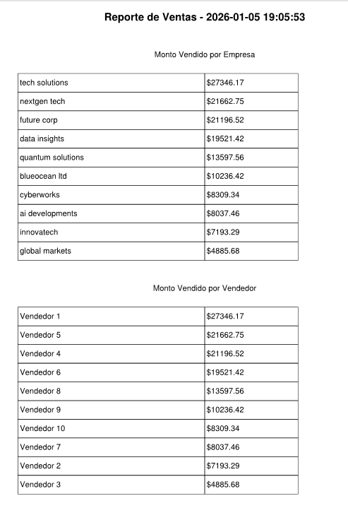

# 🐍 Inteligencia de Datos con Python: Limpieza Difusa y Reportabilidad Automatizada

> **Automatización end-to-end para saneamiento de datos y generación de reportes:** Script en Python para la corrección de inconsistencias textuales mediante lógica difusa (Levenshtein Distance), análisis cuantitativo de ventas y exportación automatizada a PDF ejecutivo.


---

## 📌 Navegación Rápida
[← Volver al Portafolio Principal](https://camiloalarcon25.github.io/Mi_Portafolio_v1/)

- [Vista General del Reporte](#-vista-general-del-reporte)
- [El Desafío de Negocio](#-el-desafío-de-negocio)
- [Arquitectura de Datos y Metodología](#arquitectura)
- [Insights y Hallazgos Clave](#-insights-y-hallazgos-clave)
- [Vistas Detalladas](#vistas)
- [Recomendaciones de Gestión](#-recomendaciones-de-gestión)
- [Recursos del Repositorio](#-recursos-del-repositorio)

---

## 📸 Vista General del Reporte

> *El script procesa datos crudos con errores de tipeo, estandariza entidades de negocio, genera gráficos de rendimiento y construye de forma 100% autónoma un informe ejecutivo en PDF.*



---

## 🎯 El Desafío de Negocio

En la operativa diaria, los registros de ventas suelen presentar errores de digitación, nombres duplicados o variaciones de marca (ej. *"Apple Inc"*, *"Apple"*, *"apple-corp"*). Esto fragmenta los datos e impide consolidar los ingresos reales por cliente o vendedor.

El objetivo de este proyecto fue **eliminar el trabajo manual de limpieza en Excel mediante un pipeline en Python**, resolviendo retos clave:
1. **¿Cómo unificar automáticamente registros de clientes con errores tipográficos sin intervención humana?**
2. **¿Cómo consolidar las métricas de rendimiento comercial evitando la duplicidad de cuentas?**
3. **¿Cómo automatizar la creación y maquetación de un reporte ejecutivo listo para alta gerencia?**

---

## <a name="arquitectura"></a>🛠️ Arquitectura de Datos y Metodología

El proyecto implementa un flujo de procesamiento y automatización estructurado en cuatro fases:

```text
[ Dataset Crudo / Inconsistente ] ──( Fuzzy Matching & Pandas )──> [ Dataset Limpio ] ──( Matplotlib & FPDF )──> [ Reporte PDF Automatizado ]
```

### 1. Limpieza y Matching con Lógica Difusa (TheFuzz / FuzzyWuzzy)

* **Algoritmo:** Uso de la distancia de Levenshtein a través de `fuzz.token_sort_ratio` para comparar cadenas de texto.
* **Estandarización:** Identificación de coincidencia más cercana contra una lista maestra de clientes/vendedores. Si la similitud es **≥ 80%**, el nombre se corrige y consolida de forma automática.

### 2. Procesamiento de Datos y Data Wrangling (Pandas)

* **Depuración:** Conversión a minúsculas, eliminación de espacios en blanco redundantes y manejo de nulos.
* **Consolidación:** Unión (`merge`) de tablas de transacciones con maestros de vendedores y agrupaciones (`groupby`) para calcular métricas clave de volumen y montos.

### 3. Visualización y Generación de PDF (Matplotlib & FPDF)

* **Renderizado de Gráficos:** Generación programática de gráficos de barras con Matplotlib para la comparativa de ingresos por empresa y rendimiento por vendedor.
* **Ensamblado del Reporte:** Construcción del PDF ejecutivo con FPDF, maquetando títulos, tablas formateadas e insertando las visualizaciones generadas en la misma ejecución.

---

## 📈 Insights y Hallazgos Clave

| Dimensión de Análisis | Método / Herramienta | Impacto y Resultado |
| :--- | :--- | :--- |
| **Saneamiento de Clientes** | Lógica Difusa (`TheFuzz`) | **100% Estandarización** de registros con errores de tipeo |
| **Tiempo de Procesamiento** | Pipeline de Python | Reducción de horas de limpieza manual a **segundos** |
| **Integridad Financiera** | Regrupamiento con Pandas | Consolidación exacta de facturación sin duplicidad de cuentas |
| **Generación de Reporte** | Librería FPDF | Creación autónoma de PDF listo para distribución ejecutiva |

### 💡 Principales Conclusiones

* **Integridad Total de Datos:** El algoritmo de Lógica Difusa eliminó el riesgo de fragmentación de ingresos, unificando cuentas que antes se contabilizaban como clientes distintos.
* **Repetibilidad y Escalabilidad:** El pipeline es 100% reexecutable; permite procesar nuevos cierres mensuales con un solo clic mantendiendo los mismos criterios de calidad.
* **Eliminación del Sesgo Humano:** Se elimina la manipulación manual de planillas Excel, asegurando la consistencia en los informes entregados a gerencia.

---

## <a name="vistas"></a>🖼️ Vistas Detalladas del Dashboard

<table width="100%">
  <tr>
    <td width="50%" align="center">
      <b>Grafico Monto Vendido por Empresa</b><br><br>
      
    </td>
    <td width="50%" align="center">
      <b>Grafico Monto Vendido por Vendedor</b><br><br>
      
    </td>
  </tr>
</table>

---

## 💡 Recomendaciones de Gestión

1. **Ajuste Fino de Umbrales de Similitud:** Calibrar el umbral de similitud (actualmente en 80%) según la variabilidad de la base de clientes para evitar falsos positivos en marcas con nombres similares.
2. **Programación de Ejecución Periódica:** Configurar la ejecución automática del script al cierre de cada mes para generar y enviar el reporte PDF por correo a los líderes de área.
3. **Ampliación de la Lista Maestra:** Mantener actualizada la base de datos de entidades válidas para garantizar un nivel óptimo de coincidencia en el matching difuso.

---

## 📂 Recursos del Repositorio

* 📄 **Reporte Automatizado Generado (PDF):** [reporte_ventas.pdf](https://github.com/CamiloAlarcon25/Inteligencia-de-Datos-con-Python/blob/main/reporte_ventas.pdf)
* 🐍 **Script de Automatización (Python):** [Ver archivo .py](https://github.com/CamiloAlarcon25/Inteligencia-de-Datos-con-Python/blob/main/generar_reporte.py)
* 📊 **Dataset de Prueba (.csv):** [Ver datos de entrada](https://github.com/CamiloAlarcon25/Inteligencia-de-Datos-con-Python/blob/main/ventas_raw.csv)
